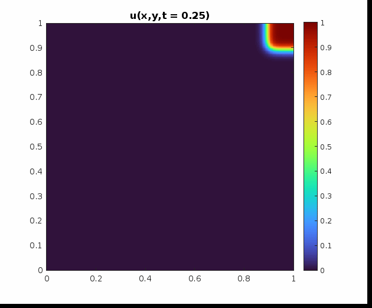

# Final Project: Monodomain Equation

This project numerically solves the Monodomain equation, a reaction-diffusion
PDE modeling the evolution of electric potential in excitable media such as
cardiac tissue.

The model is given by:

```math
\begin{align*}
	\frac{\partial u}{\partial t} - \nabla \cdot \Sigma \nabla u + f(u) & = 0   && \text{in } \Omega \times I,          \\
	\mathbf{n} \cdot \nabla u                                           & = 0   && \text{on } \partial \Omega \times I, \\
	u                                                                   & = u_0 && \text{in } \Omega \times \{0\},
\end{align*}
```

where:

* $u(x, y, t)$ is the potential,
* $\Sigma(x, y)$ is the spatially varying diffusion tensor,
* $f(u)$ is a nonlinear reaction term,
* $\Omega = (0,1)^2$, and $I = (0, T]$,
* Homogeneous Neumann boundary conditions are imposed.

---


## MATLAB Implementation

The MATLAB code implements a 2D finite element method using quadrilateral elements with:

* Explicit reaction / implicit diffusion via an IMEX time-stepping scheme,
* Spatially variable diffusivity to model different tissue types,
* M-matrix structure verification for numerical stability,
* Visualization of the wave propagation.

The figures below shows a snapshot of the potential $u(x,y,t)$ over time with $`\Sigma_d \in \{ 10, 1, 0.1 \}`$:

<p align="middle">
  
  
  
</p>
